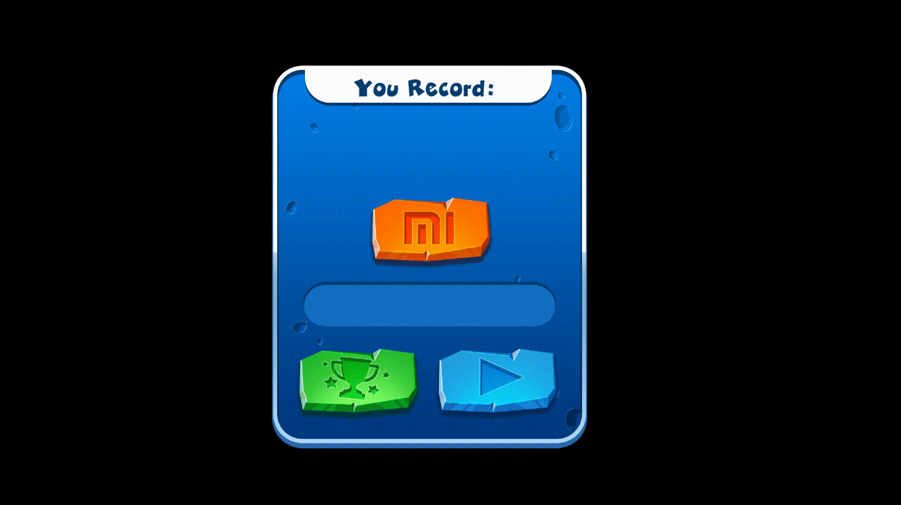

# HTML5 Game Developer

___

___
## Задание:
По ссылке вы можете ознакомиться с примером [Игры-Референс](https://mi-bunny-ride-test.web.app/game/) . Задание состоит в следующем: вам необходимо самостоятельно повторить реализацию UI проекта на pixi.js+webpack и javascript/typescript (на ваше усмотрение).
___
### UI должен включать в себя следующие элементы:
Форма интро
Форма гейменда со звездочками и лучами
Форма лидербордов
___
### Бонусное задание (для кандидатов уровня middle и выше обязательно,  для всех остальных по желанию):

Реализовать игровую механику спуска Банни по склону, не учитывая такие факторы,  как сопротивления земли и тп.,  с одинаковой скоростью и без ускорения. По тапу на экран или по нажатию на пробел Банни должен совершать прыжок, чтобы перепрыгивать препятствия на пути.

